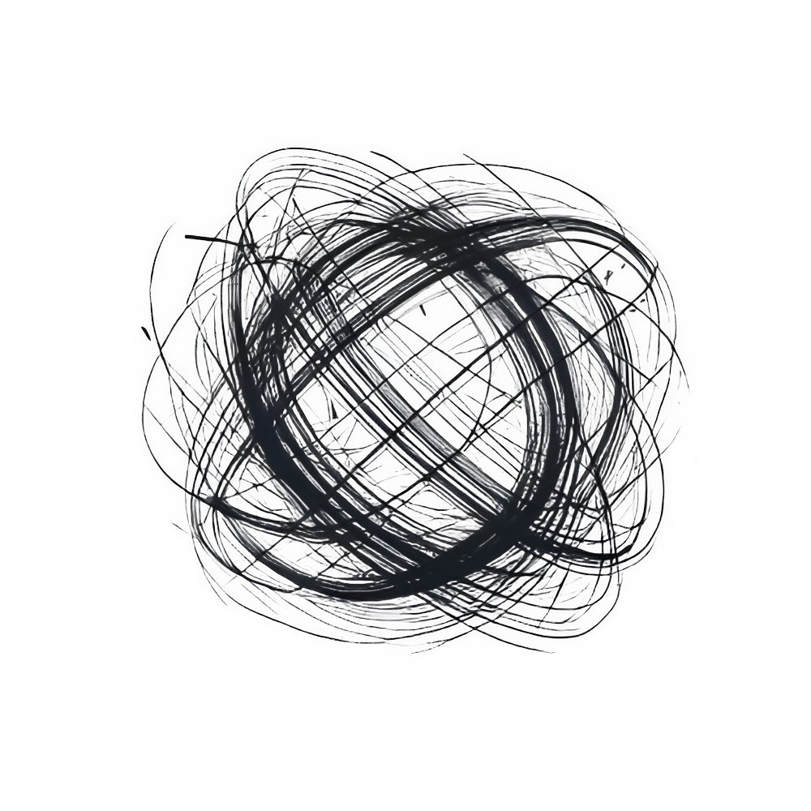

# Nyx 

  

Nyx is a **cross-platform**, **open-source** physics library designed to create high performance 2D and 3D physics simulations in real-time.

## Documentation
- [About](doc/manual/ABOUT.md)

## Development
- [Build Instructions](BUILDING.md)
- [Contributing Guidelines](CONTRIBUTING.md)

## LICENSE
Nyx as a whole is open-source software and licensed under the Apache 2.0 license.